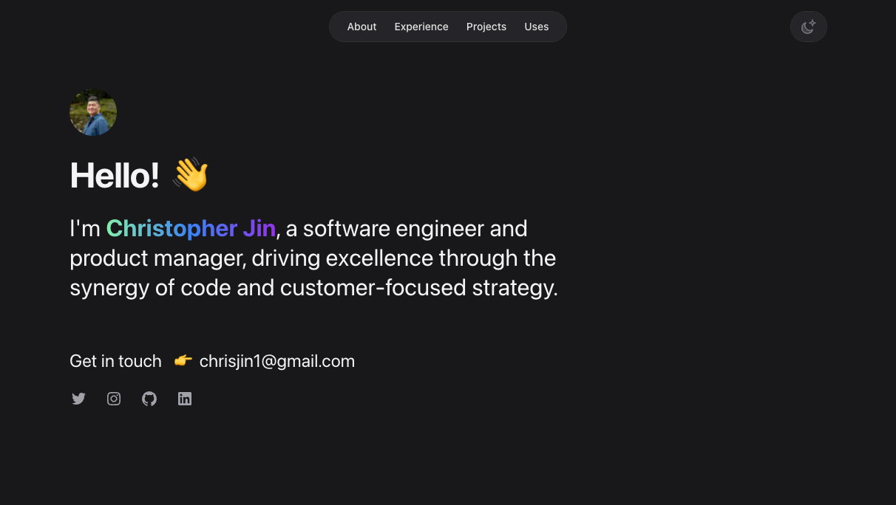

<h3 align="center">A Product-Minded Software Engineer creating User-Focused Innovations a Story at a Time</h3>

  
  
  
  

Currently a software engineer of 100Devs with product management experience, I am motivated by technology's enablement for positive change and its endless opportunities.

See [my website](https://www.christopherjin.com/) for more information!

<h1 align="center">Projects</h1>
<table bordercolor="#66b2b2">
  
  <tr>
    <td width="50%" valign="top">
      <h3 align="center">Portfolio Website</h3>
         
        
         
        

          
    
  
      

        
<strong>React, NextJS, TailwindCSS</strong> - Portfolio Site including additional links to my projects and ways to get in contact with me.

    </td>
    <td width="50%" valign="top">
      <h3 align="center">Broadway Barbers</h3>
         
      
         
        

          
  
      

        
<strong>JavaScript, CSS, HTML</strong> - A client's fully-responsive website for their Barbershop

    </td>
  </tr>
  
  
</table>

<h1 align="center">Technologies</h1>

<h3 align="left">Languages and Tools:</h3>

                      

---

<h1 align="center">Connect</h1>

  
  
  
  

-   🔭 I’m currently working on **Kandoo** and **WalletPro**

-   🌱 I’m currently learning **React, TypeScript**

-   👨‍💻 All of my projects are available at [https://github.com/IntelliJinceTech](https://github.com/IntelliJinceTech)

-   💬 Ask me about **my career journey**

-   📫 How to reach me **chrisjin1@gmail.com**
